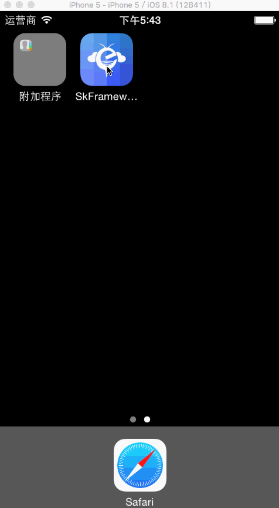

#SkFramework

SkFramework 是基于AOP的页面万能跳转库.





#Getting Started

**Using [CocoaPods](http://cocoapods.org)**

1.Add the pod `WZMarqueeView` to your [Podfile](http://guides.cocoapods.org/using/the-podfile.html).
```ruby
pod 'SkFramework', '~> 0.0.1’
```
2.Run `pod install` from Terminal, then open your app's `.xcworkspace` file to launch Xcode.

3.`#import SkLib.h` wherever you want to use the API.

**Manually from GitHub**

1.Download the `SkLib` files in th [Source directory](https://github.com/LuoYaoSheng/SkFramework/tree/master/SkFramework)

2.Add both files to your Xcode project.

3.`#import SkLib.h ` wherever you want to use the API.

#Example Usage

**Example location**

Check out the [example project](https://github.com/LuoYaoSheng/SkFramework/tree/master/SkFramework) included in the repository. It contains a few demos of the API in use for various scenarios. 

**Usage**

The way to create a WZMarqueeView is:

```objc
SkCmmObject *object = [[SkCmmObject alloc]init];
object.mSkSate = SkCmmStatePush;//跳转类型
object.mSkClassName = @"BViewController”;//跳转到的类名
object.mSkExtend = @"http://www.ilivingthebestlife.com/“;//基础扩展信息
object.mSkTitle = @"传递参数并修改标题”;//可以直接传到下级类名进行修正

[SKCmmResponder componentAction: object];
```

#License
MIT
